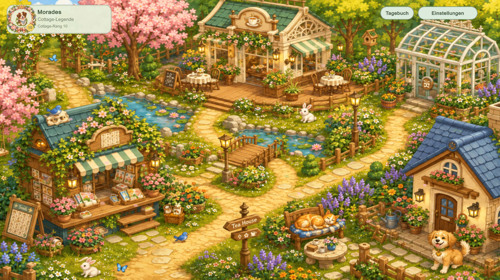
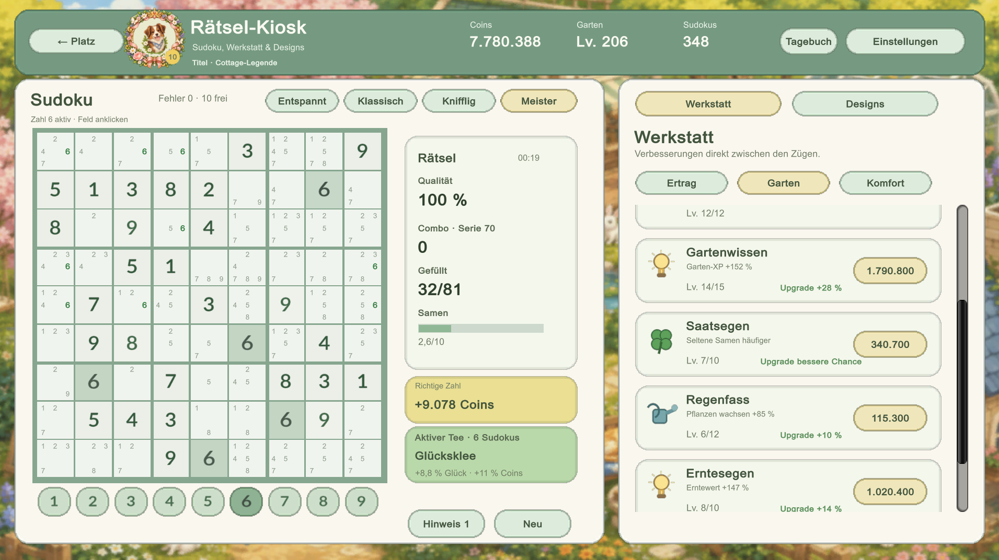
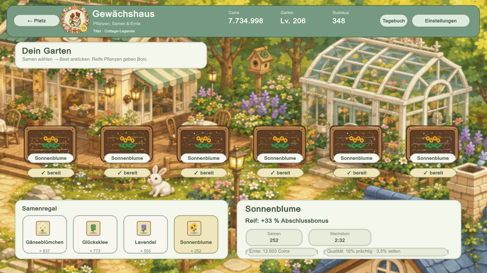
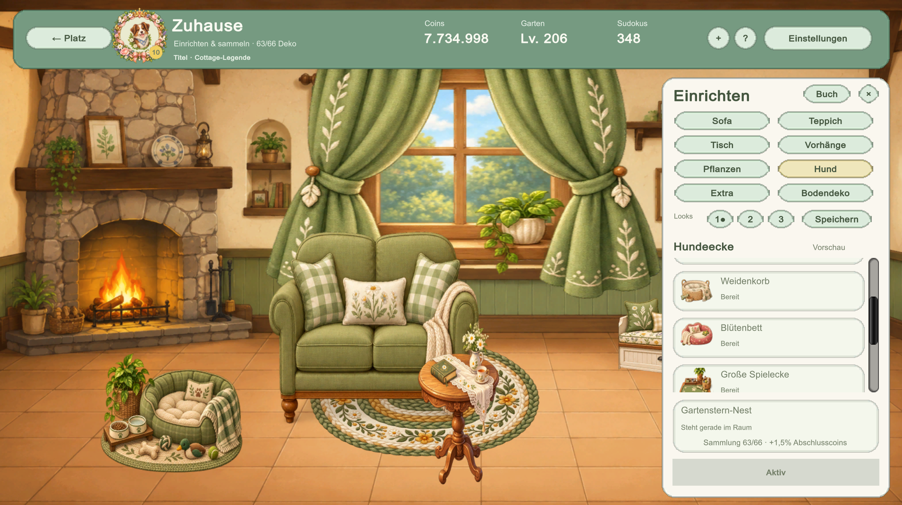
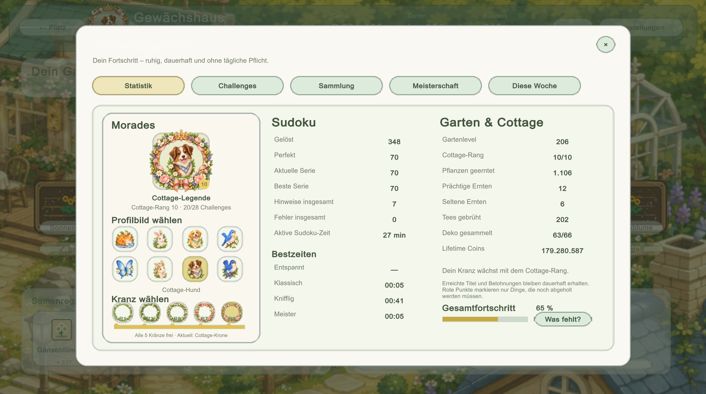

# 🌿 Cozy Sudoku Garden

**Cozy Sudoku Garden** ist ein gemütliches Singleplayer-Sudoku-Spiel mit Garten, Tee, Cottage-Einrichtung und langfristiger Progression.

Löse Sudokus in verschiedenen Schwierigkeitsgraden, verdiene Coins und Samen und baue dir nach und nach deinen eigenen kleinen Rückzugsort auf.

## ✨ Features

* 🧩 Sudokus in vier Schwierigkeitsgraden
* ✏️ Notizen, Kandidaten und Hinweise
* 🌱 Pflanzen, Samen, Wachstum und Ernten
* 🌟 Seltene und prächtige Ernten
* 🫖 Teestube mit verschiedenen Tees und Boni
* 📋 Tageswünsche und Wochenaufgaben
* 🏡 Cottage einrichten und Möbel sammeln
* 🏆 Challenges und Meisterschaften
* 🌸 Profilbilder, Kränze und Titel freischalten
* 📈 Langfristige Statistiken und Fortschritt
* 💾 Lokales Save- und Backup-System
* 🌐 Spielbar auf Deutsch und Englisch
* 📴 Komplett offline spielbar
* 🚫 Keine Werbung und keine Ingame-Käufe

## 🖼️ Screenshots

### Sudoku & Workshop

### Garten

### Cottage

### Fortschritt & Sammlung

## 🌍 Sprachen

* 🇬🇧 English
* 🇩🇪 Deutsch

Die Sprache kann jederzeit in den Einstellungen gewechselt werden.

## 🎮 Plattform

**Windows 64-Bit**

Das Spiel benötigt keine Internetverbindung.

## 📥 Download

Cozy Sudoku Garden kann kostenlos auf itch.io heruntergeladen werden:

**[Cozy Sudoku Garden auf itch.io](https://morades.itch.io/cozy-sudoku-garden)**

Das Spiel ist kostenlos verfügbar. Freiwillige Unterstützung über itch.io ist möglich.

## 🛠️ Entwicklung

Cozy Sudoku Garden wurde als eigenständiges Hobbyprojekt mit **Unity** entwickelt.

Das Projekt kombiniert klassisches Sudoku mit einer gemütlichen langfristigen Progression rund um Garten, Tee, Sammelobjekte und Cottage-Einrichtung.

## 📦 Über dieses Repository

Dieses Repository dient als öffentliche Projektseite für **Cozy Sudoku Garden**.

Der vollständige Unity-Quellcode und die internen Projektdateien sind **nicht Bestandteil dieses öffentlichen Repositories**.

Aktuelle spielbare Versionen werden über itch.io veröffentlicht.

## 💚 Cozy Sudoku Garden

Löse ein Sudoku, pflanze ein paar Samen, brühe dir einen Tee und gestalte deinen eigenen gemütlichen Garten.
